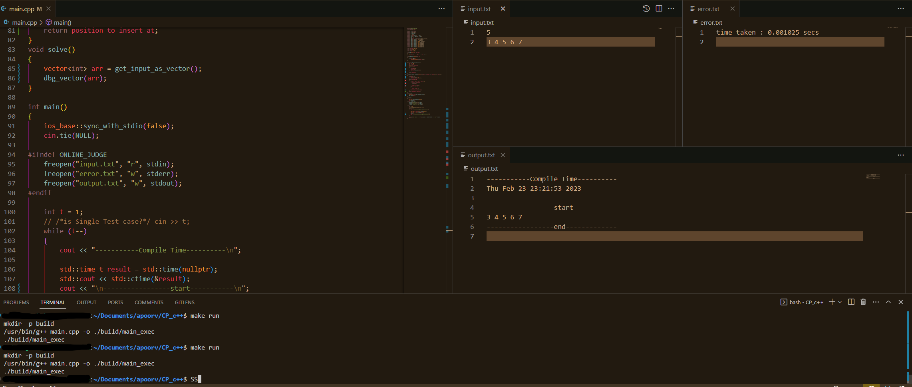

- https://vscode-debug-specs.github.io/cpp/
- CP CPP setup
-  https://code.visualstudio.com/docs/cpp/pipe-transport

## First Principle
- Chef has taken his first dose of vaccine D days ago 
    - today is friday , doctor toook vaccone on tusday at time x.
    - Tuesday time x to wednesday time x ; day count 1
    -  wednesday time x to thursday time x; day count 2
    -  thursday time x to friday time x; day count 3    
        - day count can be >  or < 3 days but we consider 3 days.
        